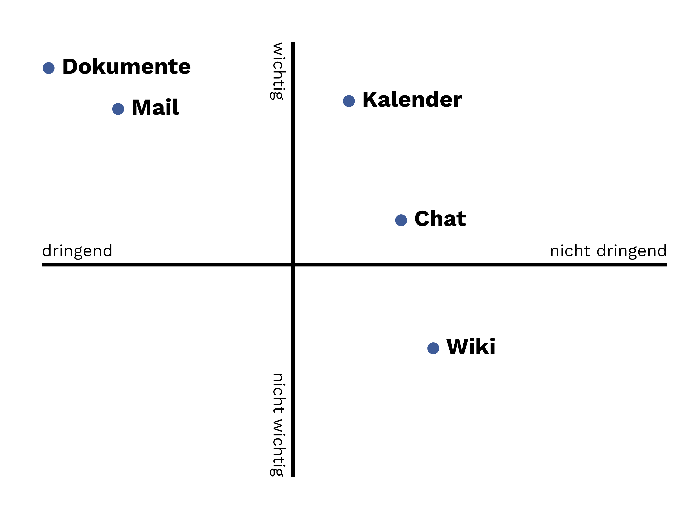

```fm
style: negative
background: true
```

## Hello _👋_

# {{process.content.frontmatter.title}}

_Erarbeitete Lösung_

<footer>

2025 · Zurich · Stefan Huber

</footer>

--s--

```fm
style: negative
background: true
```

## Teilaufgabe

# Welche digitalen _Tools_ und _Strukturen_ hältst Du für sinnvoll – und wie würdest Du diese _implementieren_ und im Team einführen?

--s--

## Erste Schritte

- **Grösste Painpoints** im Team erfragen?
- Passwörter/Secrets speichern & einführen

--s--

## Workshop-Matrix



--s--

## Outcome

- Domain & Mail aufsetzen (wenn möglich)
- Shared Calendar & meetings
- Wohin mit Dokumenten
- Geräte & Backup klären
- Interner Chat
- Internes Wiki aufsetzen
- Website/Social Media/…

--s--

## Implementierung

- Mit _Partnern_ arbeiten wo möglich <br>(Infomaniak, Nextcloud, etc.)
- Wo möglich mit _Open Source_
- Mit _bestehenden Tools_ arbeiten
- _Dokumentation_ & Schulung

--s--

```fm
style: negative
background: true
```

## Teilaufgabe

# Wie würdest Du interne und externe _Kollaboration_ (z. B. mit Organisationen, Initiativen, Kreisen) technisch sowie organisatorisch ermöglichen?

--s--

## Fragen für Workspace (Office) Tools

- Können wir uns auf _online und kollaborierend_ einigen?
- _Welche Workspace-Tools_ habt ihr bisher als unproduktiv erachtet?
- Sind wir bereit einen gewisse _Ideologie_ zu verfolgen (und ertragen)?
- Sind wir bereit anstatt Lizenzen mit Arbeit (meinerseits) zu bezahlen?

--s--

## Mögliche Tools

- [nextcloud](https://nextcloud.com/) – Files, Kalender, Kontakte, Tasks
- [Infomaniak Suite](https://www.infomaniak.com/en/ksuite) – Mail, Kalender, Kontakte, Tasks
- [rocket.chat](https://rocket.chat/) – Bridge zu anderen Chats
- [mattermost](https://mattermost.com/) – Slack-Alternative
- [zulip](https://zulip.com/) – Slack-Alternative

--s--

## Organisatorische Aspekte

- Lizenzen
- Onboarding
- Offboarding
- Access Management
- Dokumentation
- Schulung

--s--

```fm
style: negative
background: true
```

## exit 0; thx

# _Fragen?_

<style>
  .contact-links {
    padding-bottom: 1rem;
    font-size: .8rem;
  }
  .contact-links a {
    color: white;
  }
  .contact-links a:after {
    display: none;
  }
</style>

<footer class="contact-links">

**Stefan Huber** · sh@signalwerk.ch  
[mastodon.social/@signalwerk](https://mastodon.social/@signalwerk)  
[instagram.com/signalwerk](https://instagram.com/signalwerk)  
[linkedin.com/in/signalwerk](https://linkedin.com/in/signalwerk)  
[github.com/signalwerk](https://github.com/signalwerk)

</footer>
